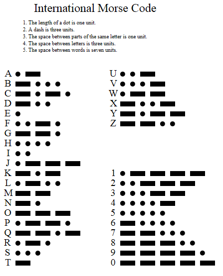
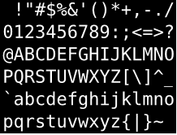
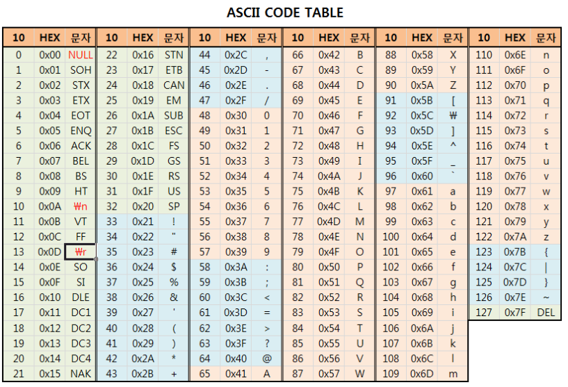

### HTML 구조화 (기초)

- **HTML 문서의 루트 요소(Root Element)**는 `<html>` 요소 뿐이다.
- 루트 요소 `<html>`은 `<head>`, `<body>` 단 2개의 자식 요소만 가질 수 있다.
- `<head>` 요소는 내부에 `<title>` 요소를 가지며, 그 값은 웹 브라우저 탭 패널 제목으로 표시된다.

```html
<html>
  <head>
    <title>웹 문서의 제목</title>
  </head>
  <body></body>
</html>
```

- **`<meta>` 는 해당 페이지에 대한 정보를 포함**한다.
> ※ [`http-equiv`](https://www.w3.org/TR/html5/document-metadata.html#attr-meta-http-equiv) 속성을 사용하면 `<meta>` 요소에서 정의된 명령(사항)을 먼저 실행한 후에 페이지를 로딩한다. 이를 **프라그마 디렉티브(Pragma Directive)**라고 한다. (`equiv`는 **equivalent**의 약자)

```html
<html>
  <head>
    <!-- HTML5 이전에 사용되던 코드 -->
    <!-- <meta http-equiv="Content-Type" content="text/html;charset=UTF-8"> -->
    <!-- HTML5에서는 아래와 같이 단축된 코드를 사용한다. -->
    <meta charset="UTF-8">
    <title>웹 문서의 제목</title>
  </head>
  <body></body>
</html>
```

텍스트 언어 인코딩을 [**UTF-8**](https://ko.wikipedia.org/wiki/UTF-8)로 설정하여 모든 유니코드 문자를 표현할 수 있도록 설정하고, **깨지는 한글 문제를 해결**한다.

-
### 문자인코딩(문자집합) / ASCII > 유니코드 > UTF-8
- **UTF-8을 알기 위해서 유니코드와 문자 인코딩을 알아야 한다.**


1. 문자 Encoding (=부호화)
###### 왜 인코딩 해야해 ?
>	부호화, 즉 문자를 나타내는 것. 그에 맞게  부호화 시켜서 호환.
> 통신 목적

###### 부호화 방법 (=encoing)
> 모스부호 ( 1860년대 )
> 초창기 알파벳을 부호화 하는 모스 부호(전기신호 이용한 통신)

- 전쟁때 사용 및 통신은 아직도 사용
한국전쟁때 송해님이 휴전전보를 알리는 모스부호 사용경험 있네요.

-
> 그 이후  ASCII 아스키 ( 미국 정보교환표준부호 1960년대)
- 
-영문 알파벳을 사용하는 대표적인 문자 인코딩
통신 및 문자사용장비는 대부분 문자인코딩 아스키에 기초
1967년 표준 제정 1986년 마지막개정
7bit 인코딩.
33개의 출력 불가능 문자 제어문자 ( 대부분은 더이상 사용 안함 ) / Serial 통신은 아직 사용함 ( 33개는 문자에 대한 수행이 있는 문자들 )



95개 공백포함, 출력 가능문자. ( 우리가 쓰는 것 )
( 알파벳대소문자 52개, 숫자10개, 특수문자 32개, 공백 1개 )
 = (기초가 되는) 아스키 기반으로 여러가지 생겨남
ISO/IEC 646 , ISO 8859, 비트 0 넣어 8bit IBM 코드페이지
각 국가마다 자기 국가에 맞게 설정된것들. ( 한국은 KS X 1001 , EUC-KR, ISO-2022-KR )
= 나중에는 다 묶어서 ASCII 라 한다.

-

유니코드
전세계의 모든 문자를 컴퓨터에서 일관되게 표현하고 다룰 수 있도록 설계된 산업 표준-협회제정
기존의 인코딩들은 다국어 환경에서 서로 호환이 안됐다.
=> 유니코드가 문자집합 통합 성공
우리가 인코딩 할때 charset="UTF-8"이 지정하는 것임.


MIME ( Multipurpose Internet Mail Extensions )
전자 우편(SMTP전송)을 위한 인터넷 표준 포맷으로 정의. 메일을 위한 한가지 인코딩 방식 포맷이라고 생각하면 되겠다.
그러나 HTTP와 같은 프로토콜에서도 사용되면서 중요성이 커지고 있다.
MIME은 HTTP와 같은 통신 프로토콜의 기본 구성 요소이다.
그 안에 content types이 정의 되어 잇다.
HTTP > MIME > content types
MIME 형식으로 변환은 서버에서 자동으로 이루어 진다.
속성의 종류  
content-type : 메시지의 종류
content-transfer-encoding : 메시지 인코딩 방식
Content-type: text(메시지타입)/plain(서브타입)
MIME은 확장 가능하다.
새로운 content-type, 속성등록


UTF-8 (Universal Coded Character Set+Transformation Format)

결국 UTF-8이 통합 방식인가?

독일,미국,프랑스,러시아 찾아보니 utf-8
중국은 gb-2312 (근데 toudou 같은데는 또 utf-8 이다 )
( utf-8에 비해서 효과적으로 저장된다는데..)
일본도 utf-8 많이씀 ( 거의 다 utf-8 씀 )
= 결국 글로벌 서비스를 위해서 UTF-8을 사용 해줘야 한다. 그리고 자국 서비스에서 인코딩방식의 특성에 따라 차이점이 있고 이점이 있다면
해당 인코딩을 사용한다.
EX.) Compared to UTF-8, GB2312 (whether native or encoded in EUC-CN) is more storage efficient, this because no bits are reserved to indicate three or four byte sequences, and no bit is reserved for detecting tailing bytes.
( .NET이냐 , Python, java, ruby 냐에 따라서 조금씩 차이가 생긴다. )


> #### UTF-8 인코딩

> ##### 장점
  - UTF-8은 모든 유니코드 문자를 표현할 수 있다.
  - 바이트 표현의 첫 바이트만 사용하여 해당 바이트 표현의 길이를 결정할 수 있다. 따라서 부분 문자열을 얻는 과정이 매우 쉽다.
  - 인코딩에 간단한 비트 연산만 사용되므로 효과적이다. UTF-8은 곱셈이나 나눗셈과 같은 느린 연산들을 사용하지 않는다.

> ##### 단점
  - 대부분의 UTF-8 문자열은 일반적으로 적당한 기존 인코딩으로 표현한 문자열보다 더 크다. 판독 기호를 사용하는 대부분의 라틴 알파벳 문자는 적어도 2바이트를 사용하며, 한중일 문자들과 표의 문자들은 적어도 3바이트를 사용한다.
  - 한중일 문자들과 표의 문자를 제외한 거의 모든 기존 인코딩들은 한 문자에 1바이트를 사용하므로 문자열 처리가 간편한 반면, UTF-8은 그렇지 않다.
