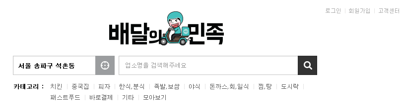
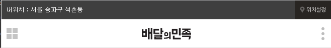
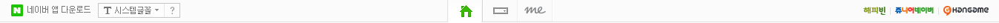

# Navigation은 어떻게  작성하는게 좋을까?  
###### UI에 따른 여러가지 방법을 분석 해보자.

### 보편적으로 ul, li, a에 어떤 속성을 적용 시키는게 적합할까?
```css
	/* overflow: hidden 보다 clearfix */ 
	/* ul에 margin:0, padding:0로 초기화 시키는 별도 파일을 만들거나 reset에서 적용하자. ex. common.css */
	#main_gnb > ul { list-style-type: none; width: 200px; background-color: #f1f1f1;}
	#main_gnb > ul > li{ float: left; }
	#main_gnb > ul > li > a {
		display: block;
		padding: 10px 20px;
		color: #fff;
		text-decoration: none;
	}
```
##### 대부분의 요구사항
- 수평으로 나열된 Navigation을 만드려고 한다.
- 텍스트 뿐만 아니라 여백까지 버튼 하나의 영역을 클릭 하기를 원한다.

##### 해결하기 위한 방법
- `<a>`는 `inline` 속성이므로 텍스트 크기만큼만 지정 되어있다. 그래서 `<a>`를 `block` 요소로 바꾸고 `padding`으로 여백을 버튼 하나 크기 만큼 늘려줘야 한다.
- `<ul>` 에는 기본적으로 아래 만큼에 `margin`, `padding`이 존재한다. 그래서 이 값을 0으로 초기화 시킨다.
- **my-research** `<ul>`의 margin 값은 자식 `<ul>`의 `font-size`값에 영향을 받는다. `<body>`의 기본인 16px에 영향을 받지만 `<ul>`에 font-size가 적용된다면 그 값에 영향을 받는다.
	- `margin-top: 16px;`, `margin-bottom: 16px;`
	- `padding-left: 40px;` 

### `header` 부분을 만들때  자식, 자손의 중앙 위치 지정
```css
	#main_header { 
		/* 배경 지정 */
		height: 45px;
		background: url('');
		/* 자손 위치 지정 */
		position: relative;
		text-align: center;
		line-height: 45px;
	}
```

-----
### 실제 사이트 분석 

##### 실제 사이트들의 Navigation은 어떻게 구성했는지 분석해보자.
##### 문제점은 무엇인가?
##### 내가 만들었다면 어떻게 했을 것 인가?

### Case01. [배달의 민족](http://www.baemin.com/?gclid=CISfuM-epc4CFU0AvAodV3YEXQ)



##### My Code
```html
	<div class="gnb_wrap">
		<ul class="gnb_list">
			<li><a href="#">로그인</a></li>
			<li><a href="#">회원가입</a></li>
			<li><a href="#">고객센터</a></li>
		</ul>
	</div><!-- gnb_wrap -->
```

##### Present Code
```html
<div class="gnb-wrap">
	<span class="navigation" onclick="toggleLayer('gnb','navigation');return false;">네비게이션</span>
	<ul class="list-inline gnb">
		<li><a href="javascript:;" onclick="openLayer('gnb-mem');return false;">로그인</a> <em>|</em></li>
		<li><a href="https://www.baemin.com/member/signup">회원가입</a> <em>|</em></li>
		<li><a href="http://www.baemin.com/service/faq">고객센터</a></li>
	</ul>
</div>
```
##### 코드 분석 
###### HTML
- 전체를 컨트롤 하기 위해 `<div>`요소로 감싸고 class name은 gnb-wrap(global navigation bar + wrap)을 사용한다.
- 단순한 `|` 모양을 `<em>`으로 처리한 것은 의미상 옳지 않은게 아닌가 싶다. 나라면 css에서`border-right`로 처리 할 것 같다.

###### CSS
- .gnb-wrap
	- 위치를 `position:absolute`로 설정하고 숨겨놓은 네비게이션은 `overflow: hidden` 처리를 하였다. 
- .navigation
	- sprite-image로 처리하여 `active` 했을 때와 안했을 때의 차이를 `background-positioin`으로 설정하였다.
	- `text-indent: -9999px`을 사용하여 접근성을 지킨 것 같다.
	- 반응형에 따라 `font-size`를 달리 하였다.
- li
	- 나는 `float: left`로 처리 했었는데 여기서는 `display: block;`을 주었다. 


##### 놓쳤던 부분
- pc화면에서는 텍스트로 `gnb`를 만들고 숨겨진 반응형 웹에 따라 모바일에서는 숨겨놓은 아이콘`<span>네비게이션</span>`을 사용한다.

----
### Case02. [Naver](http://www.naver.com/)

<!--  -->

#### 부분별 코드 

###### 숨겨진 제목 처리방법
##### My Code
```html
<div class="gnb_wrap clearfix">
	<h2 class="hidden_title readable-hidden">네비게이션</h2>
	<div class="gnb_left_wrap clearfix">
	.....
```
##### Present Code
```html
<div class="gnb" queryid="C1470310817015616182">
    <h2 class="blind">홈 유형 선택</h2>
    <ul class="nav_hm">
	.....
```

###### 숨겨진 제목 처리방법
##### 

##### 코드 분석 
###### HTML
- 


###### CSS

##### 놓쳤던 부분
- **important** 네이버홈,검색,me
	- 아이콘 시각적으로 중앙에 위치. 
	- 그러나 마크업으로는 가장 먼저 하였다. 
	- html 해석에서 의미상 어느것이 더 중요한가를 고민하는게 중요하다.
- **important** 숨겨진 제목
	- 여러가지 기능이 있으면 그걸 통합하는 하나의 제목이 필요하다. 접근성 관점.
- 

### 총 정리: 좀 더 탐구 해야 할 부분
- `float: left`와 `display: inline-block` 중 어떤 처리가 더 적합한지 테스트 해봐야 되겠다.
- 접근성 관점에서 전체 목록에 대한 제목을 스크린리더로 읽어줘야 할까? 고민 해보자.


Q. 왜 select_font에는 cursor: pointer가 상속 받지 않는가? 

``` 
<button class="font_style"><span>시스템글꼴</span></button>
<button class="arrow"></button>

<button class="font_style"><span>시스템글꼴</span></button><button class="arrow"></button>
```
이럴 경우에 빈칸 때문에 공백이 생긴다. css로 처리할게 아니라 그냥 html에서 붙여주자.

왜 .font_style에 outline-color가 안먹히지?

naver는 x같은 버튼 또한 `<a>`로 처리 했는데 의미상 맞지 않는 것 같다. 그래서 난 `<button>`으로 처리 했는데 background만 주니까 width와 height 값을 갖지 못해서 background가 들어 가지 않는다. 그렇다면 난 a로 해야 할까?

text-indent는 block container에만 지정가능하다.
css 주요 속성 
background
text
등... applies to를 찾아보자.

`<a>`요소에 images를 적용시키고 text-indent를 적용하니
텍스트의 자리가 날라가면서 이미지 공간이 줄어서 인지 이동을 했다.

`padding: 0px 20px` 속기형 처리 했는데 `padding: vertical horizetal`이 아닌 20px이 left값으로 적용됐다. 왜이렇까?

inline 요소에 background를 선택시 반드시 block요소로 처리하고 
width, height 값을 넣어야 한다.

padding : vertical horizotal
padding : top horizontal bottom
padding: top right bottom left

navigation에서 사이 여백+실선 일때는
li { border를 넣고}
a { margin 또는 padding으로 처리 해야한다.}